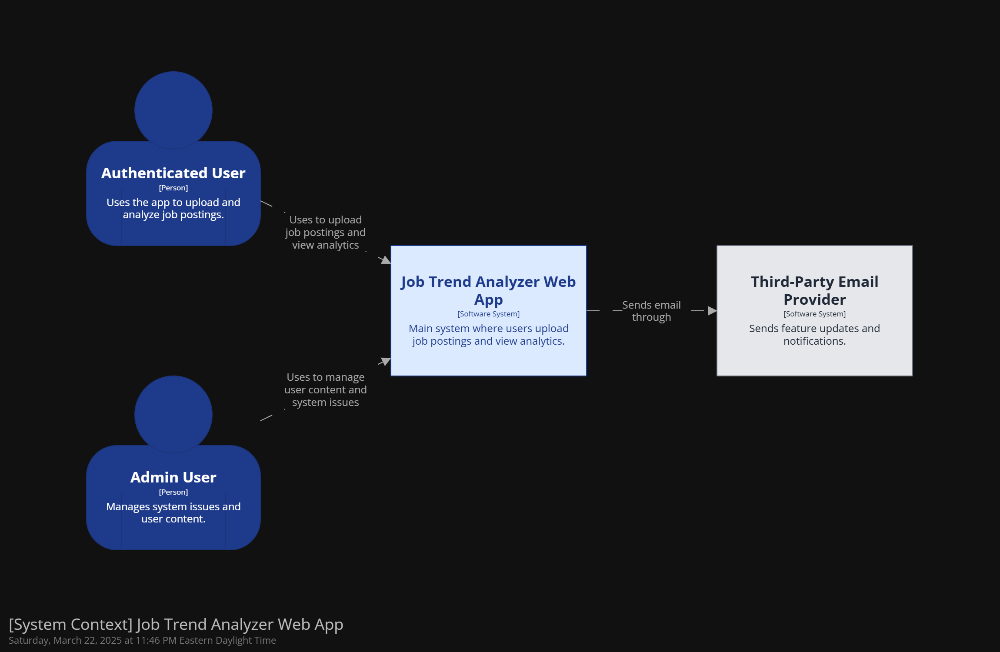
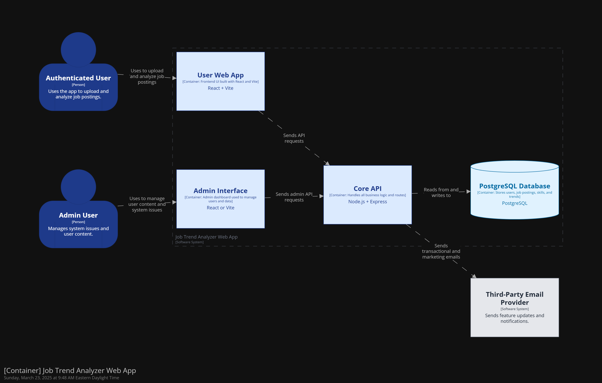

# Project Spec

## 0. Project Overview

**Job Trend Analyzer** is a productivity tool meant for **identifying skills patterns across a variety of job postings and titles**, starting with the pursuit of a successful MVP.

The project currently has a team of one software engineer ([Jonathan Hammond](https://www.linkedin.com/in/jonamichahammo)). Designed with the intention of gaining re-employment, while also building a tool that helps users find work in the meantime. The build-time deadline for this project is June 1st, 2025.

My goal as the frontend architect of this project is to **design the architecture of Job Trend Analyzer's user-facing web application**. This includes gathering requirements, designing an architecture that meets those requirements, and releasing project updates on LinkedIn during implementation. All which will culminate in the product being available for users.

## 1. Job Trend Analyzer Software System

_This section describers the entire Job Trend Analyzer software system. This includes the users of the system, as well as all the applications, databases, and APIs the system is made of. The application that we're building (the user-facing web app) is a part of this system._

### System Context

_This is a zoomed out view of the Job Trend Analyzer system and the context around it. The system context diagram below follows the guidelines of the C4 Model for visualizing software architecture._

#### System Users

- **👩🏻 Authenticated User** — Job Seekers tracking the skills and phrases they see on job postings. They use the User Web App client to upload job role descriptions and highlight skills (hard and soft), as well as job role phrases, to identify patterns for items commonly in demand, and use this to focus on what to either add on their resume or upskill on.

- **👩🏻 Admin User** — Members of JTA's employees (me) who manage and moderate the JTA system. Useful for when features haven't been implemented yet, or if anything buggy occurs. Eventually will have their own dashboard.

- **🤖 Unauthenticated User** — Unauthenticated users have access to the demo of the User Web App, which allows them to explore the features of the application and understand how it works.

#### External Systems

- **Third-Party Emailing System** — Emailing system used by Job Trend Analyzer's applications to notify users on updates, such as when the product features will be available for usage.

- **Job Trend Analyzer Admin System** — Software system used by JTA's employees (me) manage and moderate the JTA system. Probably will consist of full access to user accounts for replication purposes, with expanded editing features.

#### System Context Diagram

### System Containers

_These are the building blocks of the system. Use this list as well as the system context diagram above to build the container diagram for the Job Trend Analyzer software system._

- **User Web App** [React] — This is the app that we're designing the architecture for. It's a web application used by customers to search for restaurants and make food delivery orders.
- **Core API** [Node.js/Express] — REST API used by the User Web App and Job Trend Analyzer Admin System to manage user information, job postings, and [needs more description on what the API does]. The Core API also acts as a gateway to external systems (i.e. emailing and admin systems.)
- **Core Database** [PostgreSQL] — Main data store for the application. The Core API reads from and writes to this database.

#### Container Diagram

---

## 2. Job Trend Analyzer User Web Application

_Still needs Figma..._

_This section describes the user-facing application in more detail. It's meant to give you a high-level understanding of the app we're designing the architecture for, and it should have enough information to complete the exercises in the workshop._

### UI Designs

_To be completed..._

👉🏽 Check out the [Figma spec](https://www.figma.com/design/To-DO).

_Note: This is not an **actual** UI spec—it's just screenshots from Uber Eats with a different logo. We'll refer to the spec in a few modules, but it's provided mainly for illustration purposes. UI copyright belongs to Uber Eats._

### Functional Requirements

_This section lists some of the main functional requirements of Job Trend Analyzer's web app. This is more of a functionality overview to help guide some of your architectural decisions - Needs a Run through later on._

#### Authentication

- Users can browse the app without being authenticated.
- Users can create an account using email or social media accounts (e.g., Google).
- Users can authenticate using their created account credentials.
- Authenticated users can reset their passwords if forgotten.
- Authenticated Users can sign up for email alerts for when new features are released (or updates in case pricing options ever surface).

#### Uploading and Managing Job Postings

- Authenticated users can upload job postings using a standardized form, manually
- The system parses the job description text into taggable segments (words or phrases).
- Authenticated users can tag the segments as hard skills, soft skills, or custom phrases.
- Authenticated users can view and edit previously uploaded postings from their dashboard.

#### Tagging Skills and Phrases

- Users can highlight one or more words from a job posting and tag them as:
  - Hard skill
  - Soft skill
  - Custom phrase
- Tagged items are saved and linked to the corresponding job posting.
- Tagged items are color-coded based on their type.
- Users can update or remove tags at any time.
- The system maintains a structured database of tagged phrases for aggregation.

#### Confidence Tracker

- Authenticated Users can utilize a star-review system to rank their confidence they have in each skill or phrase
- Authenticated Users can create multiple Trackers (in case they have roles for 'Nurse', 'Developer' 'Analyst', etc.)

#### Data Export (Optional)

- Authenticated Users can create global ideal candidate resumes, in attempts to base the "perfect candidate" containing lists of all skills and phrases for roles with this specific title
- Authenticated Users can create global skillbase resumes, in attempts to document all the skills they currently have in relation to the requirements and "nice to haves" sections of resumes they see for related roles
- Users can CRUD these
- Users can create multiples of either, since their skillset (ideal or personal) may span multiple job titles
- Authenticated users can export their resumes in [TBD] format

#### B. Y. O. C.

- Authenticated users who upload job postings can create card grids with links and text, allowing them to create a To-Do list-type interface through building their own curriculum.
- Authenticated users can track and rate their own skills with notes to help them stay organized with their upskilling progress.
- Authenticated users can have multiple curriculums.

#### Dashboard and Data Visualization

- Authenticated Users can access an interactive dashboard summarizing the most prevant hard skills, soft skills, and custom phrases.
- Dashboards are filterable by job title, phrase type, and skill keyword.
- Authenticated Users can configure which dashboard tab they want to view.
- The dashboard may include the following visualizations:
  - Bar charts showing top skills and phrases
  - Word clouds showing frequency-weighted terms
  - Back-to-back bar charts comparing job roles
  - Heat charts
  - Pie charts showing the distribution of skill types
- Authenticated Users can save notes to the bottom of their dashboard (Notes)

#### Public vs. Private Data Access

- An authenticated user's dashboard shows aggregated, filterable data from their own job postings.
- Authenticated users have access to edit and manage their own data, while public users have local and read-only access to the demo only.

#### Notifications, Automation, and Future Features (Optional/Future)

- Authenticated users who sign up for emails may receive notifications for new features.
- The system may automate the process of uploading job postings in the future, once the API is integrated with AI features.
- Authenticated Users can create views for specific queries.

### Architectural Requirements

👉🏽 Check out the [requirements doc](requirements.md).
